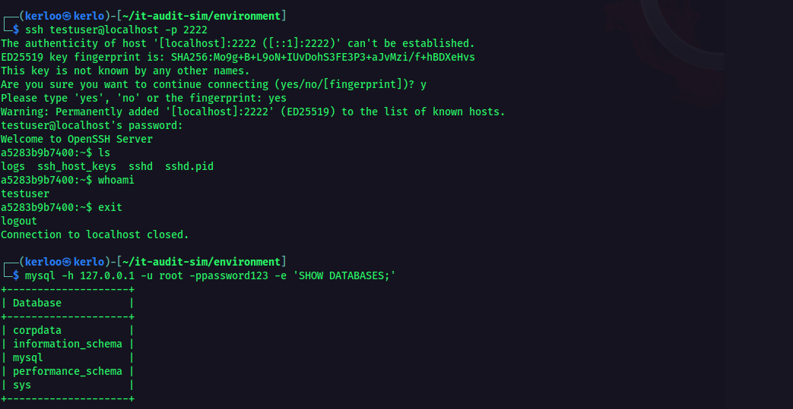
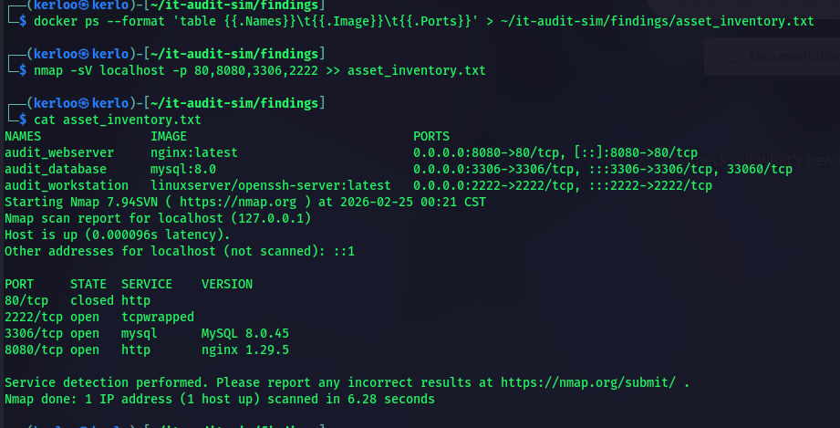
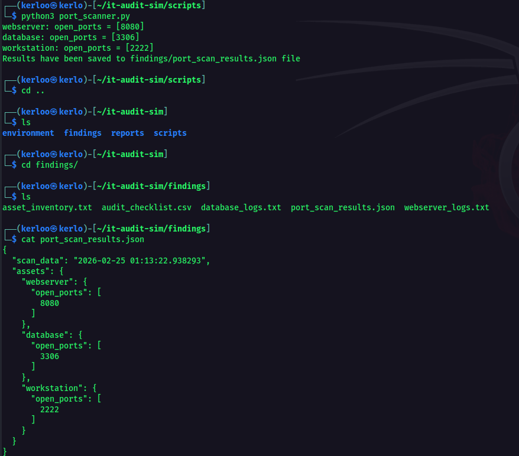
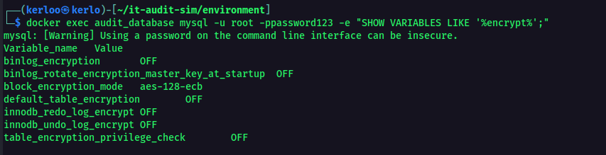

## IT AUDIT Simulation and Report
Author: Abdulmuizz Wahab

## Software Technologies used
Docker,
Python,
NIST CSF, 
Kali Linux,
MySQL,
NGINX

## Architecture Diagram

'''
┌─────────────────────────────────────────────────────┐
│                   Kali Linux Host                   │
│                                                     │
│  ┌─────────────────┐      ┌─────────────────┐       │
│  │ audit_webserver |      │  audit_database │       │
│  │ nginx:latest    │      │   mysql:5.7     │       │
│  │                 │      │                 │       │
│  │  Port 8080:80   │      │  Port 3306:3306 │       │
│  └────────┬────────┘      └────────┬────────┘       │
│           │                        │                │
│           └──────────┬─────────────┘                │
│                      │                              │
│             ┌────────┴────────┐                     │
│             │audit_workstation│                     │
│             │openssh-server   │                     │
│             │                 │                     │
│             │  Port 2222:2222 │                     │
│             └─────────────────┘                     │
│                                                     │
│         Docker Network (bridge)                     │
└─────────────────────────────────────────────────────┘

-- All Containers run on a docker bridge network on kali linux
-- Ports are intentionally misoncfigured to simulate a real-world audit target

'''
## Audit Methodology
This project applies the NIST Cybersecurity Framework (CSF), which structures security assessments across five core functions: Identify, Protect, Detect, Respond, and Recover.
A Docker-based mock environment was built to simulate a real corporate infrastructure, allowing each function to be tested against intentionally misconfigured systems that reflect common real-world vulnerabilities.
Identify — Nginx and the supporting containers are scanned using nmap and a custom Python port scanner to build an asset inventory, documenting all running services, open ports, and network accessibility across the environment.
Protect — The SSH workstation and MySQL database are used to test access control and data protection. This simulates a scenario where a threat actor has already gained network access, assessing whether proper credential policies and encryption controls are in place to limit the damage.
Detect — Container event logs are reviewed to determine whether any detection capability exists, specifically whether an IDS or IPS is deployed that could identify and alert on suspicious network activity in real time.
Respond — The environment is assessed for the existence of a documented incident response plan, evaluating whether there is a defined process for containing and communicating a security incident.
Recover — A review is conducted to determine whether a disaster recovery and backup policy exists, ensuring the organization could restore operations following a security event.

## Key Finidngs
-- Weak Database Credentials (Critical -- risk)
  
  
-- Open Port Detection (High -- risk)
  
  

-- No Encryption at Rest (Critical -- risk)
  
  
## How to Run
  -- Software Need:
    -- Kali Linux (or any Debian-based Linux)
    -- Python 3 installed 
    -- git installed 

  1. Clone Repo
    -- git clone https://github.com/ok3tty/it-audit-sim.git
    -- cd it-audit-sim

2. Install Docker if not already installed
   -- sudo apt update && sudo apt install -y docker.io docker-compose
   -- sudo systemctl enable docker && sudo systemctl start docker
   -- sudo usermod -aG docker $USER
   -- newgrp docker
3. Launch the mock environment
   -- cd environment
   -- docker-compose up -d
   -- docker ps   # verify all 3 containers are running
4. Run the port scanner
   -- python3 scripts/port_scanner.py
5. Run the risk scorer
   -- python3 scripts/risk_scorer.py
6. before exit make sure to shut down docker environment
   -- cd environment
   -- docker-compose down
   
## Sample:
  -- Risk Report Output
    
